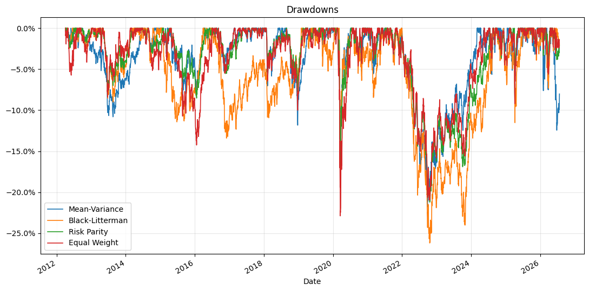

# Portfolio Optimization Engine

Compares three institutional portfolio construction methodologies across a 10-asset global ETF universe: Markowitz mean-variance, Black-Litterman, and risk parity. Each is validated through a walk-forward out-of-sample backtest from 2012 to 2026 with quarterly rebalancing, Ledoit-Wolf covariance shrinkage, and transaction cost modeling, benchmarked against equal weight.

All three optimizers are implemented from scratch using SciPy rather than a portfolio optimization library.

## Out-of-Sample Performance

| Strategy | Ann. Return | Ann. Vol | Sharpe | Max Drawdown | Avg Turnover |
|---|---|---|---|---|---|
| Mean-Variance | 8.6% | 9.9% | 0.72 | -21.8% | 19.6% |
| Black-Litterman | 6.7% | 10.2% | 0.52 | -26.2% | 7.3% |
| Risk Parity | 5.7% | 7.8% | 0.53 | -21.2% | 4.4% |
| Equal Weight | 6.7% | 10.0% | 0.54 | -22.9% | 0.0% |

## Drawdowns

## What the Views Did

The Black-Litterman run encoded two investor views: a mild relative view (emerging markets outperform developed international by 1%) and an aggressive absolute view (long-duration Treasuries return 10%, on the reasoning that falling rates lift long bonds most).

The allocation path shows the model doing exactly what it was told. The aggressive rates view drove long Treasuries to the 40% concentration cap from 2014 through 2020, alongside REITs also pinned at the cap.

That view paid off for roughly eight years, and Black-Litterman led every other strategy from 2014 into 2022. The 2022 rate-hiking cycle then reversed it: long-duration bonds sold off hard, and the strategy gave back its entire lead, finishing with the same annualized return as equal weight but a deeper maximum drawdown. Black-Litterman took more risk to arrive at the same place.

## Findings

1. **Mean-variance won on Sharpe but at 4x the turnover.** At 19.6% average turnover per rebalance against 4% to 7% for the alternatives, a meaningful share of that edge is implementation cost the headline Sharpe does not show.
2. **Black-Litterman is only as good as its views.** The model faithfully expressed a high-conviction rates view, which meant it also faithfully expressed the reversal. Same return as equal weight, worse drawdown.
3. **Risk parity delivered its mandate.** Lowest volatility, shallowest drawdown, lowest turnover, and the lowest return.

## Known Limitation

The Black-Litterman views are static: the same view is applied at every rebalance across fourteen years, which no real investor would do. The backtest is therefore closer to a sensitivity test measuring what a fixed high-conviction view costs when it reverses, rather than a realistic Black-Litterman process. Generating views dynamically from data available at each rebalance date is the natural next step.

## Methods

- **Mean-variance:** max-Sharpe and min-volatility portfolios via SLSQP, 40% single-asset cap
- **Black-Litterman:** posterior expected returns blending market-cap equilibrium with investor views
- **Risk parity:** equal risk contribution solved by minimizing squared deviations of risk-contribution shares
- **Covariance:** Ledoit-Wolf shrinkage toward a structured target

## Stack
Python, NumPy, pandas, SciPy, scikit-learn, matplotlib, yfinance
